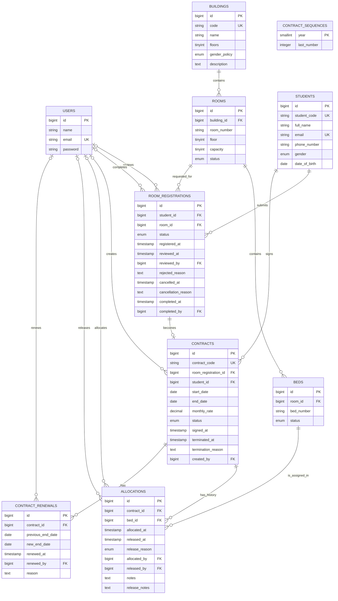
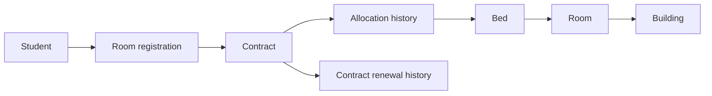
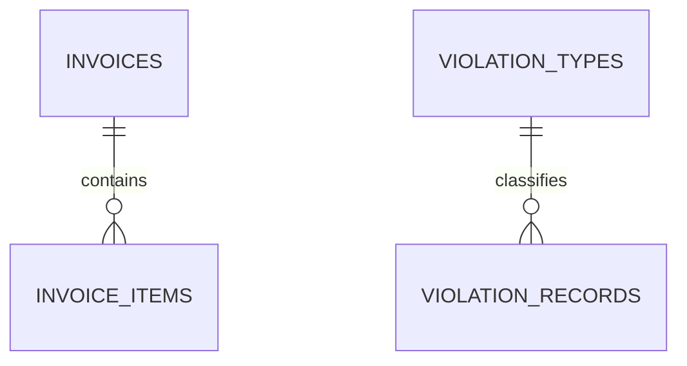

# Sơ đồ quan hệ thực thể (ERD)

## Phạm vi

ERD dưới đây phản ánh các khóa ngoại và ràng buộc đang có trong migrations của Module 1–3: cơ sở vật chất, đăng ký chỗ ở, phân giường và hợp đồng. Đây là nguồn tham chiếu cho các thay đổi liên quan đến `Allocation` và `Contract`.

## Cách đọc luồng Module 3

- `room_registrations.room_id` là **phòng nguyện vọng** khi sinh viên đăng ký; không phải phòng ở hiện tại.
- `contracts` không có `room_id`. Phòng/giường hiện tại luôn được truy vấn qua allocation có `released_at = null`.
- Một `Contract` có nhiều `Allocation` để giữ lịch sử phân giường và chuyển phòng; chỉ một allocation được hoạt động tại một thời điểm.
- `CONTRACT_SEQUENCES` là bảng độc lập để sinh mã hợp đồng `HD-[Năm]-[Số thứ tự]`, không có khóa ngoại.

## Ràng buộc quan trọng

| Bảng | Ràng buộc |
| --- | --- |
| `rooms` | `(building_id, room_number)` là duy nhất. |
| `beds` | `(room_id, bed_number)` là duy nhất. |
| `room_registrations` | Tối đa một đơn `pending`, `waitlist` hoặc `approved` cho mỗi sinh viên. |
| `contracts` | `room_registration_id` là duy nhất; mỗi sinh viên tối đa một hợp đồng `active`. |
| `allocations` | Mỗi giường và mỗi hợp đồng tối đa một allocation có `released_at IS NULL`. |
| `contract_renewals` | `new_end_date` phải sau `previous_end_date`. |

## Các bảng ngoài phạm vi quan hệ khóa ngoại hoàn chỉnh

Các bảng dịch vụ/hóa đơn/vi phạm hiện có trong schema nhưng một số cột liên kết vẫn là `unsignedBigInteger`, chưa có foreign key vật lý: `utility_readings.room_id`, `invoices.room_id`, `invoices.student_id`, `invoice_items.service_type_id`, `violation_records.student_id` và `violation_records.recorded_by`.

Vì vậy, ERD không vẽ các liên kết đó như ràng buộc database. Hai quan hệ khóa ngoại thực tế của nhóm bảng này là:

Khi Module Dịch vụ/Hóa đơn hoặc Vi phạm được chuẩn hóa, cần bổ sung foreign key tương ứng trước khi mở rộng ERD chính.
