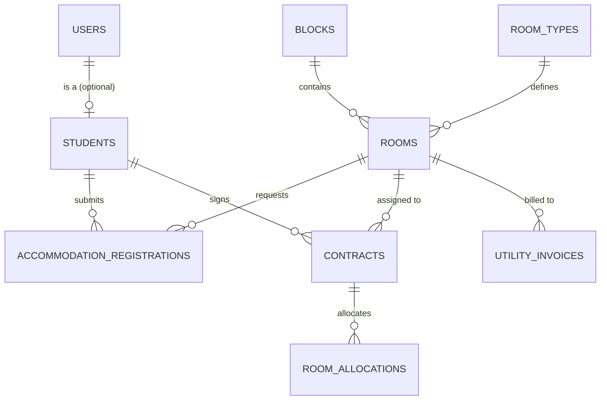

# Sơ đồ quan hệ thực thể (ERD)

Sơ đồ ERD (Entity Relationship Diagram) thể hiện mối quan hệ giữa các thực thể chính trong Hệ thống Quản lý Ký túc xá.

## Giải thích các thực thể
1. **USERS**: Chứa thông tin tài khoản đăng nhập của Sinh viên, Cán bộ quản lý và Quản trị viên.
2. **STUDENTS**: Chứa thông tin chi tiết của sinh viên (mã sinh viên, lớp, khoa, ngày sinh...).
3. **BLOCKS**: Danh sách dãy nhà / tòa nhà trong ký túc xá.
4. **ROOM_TYPES**: Định nghĩa các loại phòng (đơn giá phòng, số lượng giường).
5. **ROOMS**: Danh sách các phòng cụ thể thuộc dãy nhà nào, loại phòng nào.
6. **ACCOMMODATION_REGISTRATIONS**: Đơn đăng ký chỗ ở của sinh viên.
7. **CONTRACTS**: Hợp đồng thuê phòng của sinh viên.
8. **UTILITY_INVOICES**: Hóa đơn điện nước hàng tháng của từng phòng.
9. **ROOM_ALLOCATIONS**: Bản ghi chi tiết phân sinh viên vào giường/phòng cụ thể nào trong thời hạn hợp đồng.
