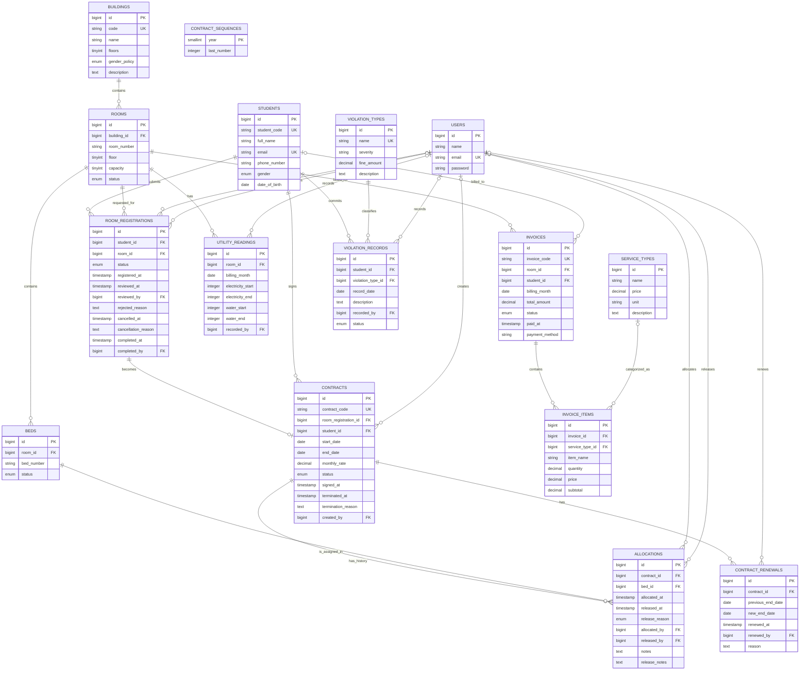
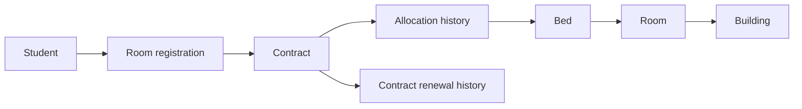

# Sơ đồ quan hệ thực thể (ERD)

## Phạm vi

ERD dưới đây phản ánh các thực thể, khóa ngoại và ràng buộc logic của toàn bộ hệ thống. Các bảng thuộc Module Dịch vụ, Hóa đơn và Vi phạm được vẽ đầy đủ các quan hệ để thể hiện đúng logic nghiệp vụ, dù trong code một số cột hiện tại mới chỉ là `unsignedBigInteger`.

## Cách đọc luồng Module 3

- `room_registrations.room_id` là **phòng nguyện vọng** khi sinh viên đăng ký; không phải phòng ở hiện tại.
- `contracts` không có `room_id`. Phòng/giường hiện tại luôn được truy vấn qua allocation có `released_at = null`.
- Một `Contract` có nhiều `Allocation` để giữ lịch sử phân giường và chuyển phòng; chỉ một allocation được hoạt động tại một thời điểm.
- `CONTRACT_SEQUENCES` là bảng độc lập để sinh mã hợp đồng `HD-[Năm]-[Số thứ tự]`, không có khóa ngoại.

## Ràng buộc quan trọng

| Bảng | Ràng buộc |
| --- | --- |
| `rooms` | `(building_id, room_number)` là duy nhất. |
| `beds` | `(room_id, bed_number)` là duy nhất. |
| `room_registrations` | Tối đa một đơn `pending`, `waitlist` hoặc `approved` cho mỗi sinh viên. |
| `contracts` | `room_registration_id` là duy nhất; mỗi sinh viên tối đa một hợp đồng `active`. |
| `allocations` | Mỗi giường và mỗi hợp đồng tối đa một allocation có `released_at IS NULL`. |
| `contract_renewals` | `new_end_date` phải sau `previous_end_date`. |

## Ràng buộc khóa ngoại của Dịch vụ, Hóa đơn và Vi phạm

Các bảng dịch vụ/hóa đơn/vi phạm hiện có trong schema nhưng một số cột liên kết vẫn là `unsignedBigInteger`, chưa có foreign key vật lý (như `utility_readings.room_id`, `invoices.room_id`, `invoices.student_id`, `invoice_items.service_type_id`, `violation_records.student_id` và `violation_records.recorded_by`).

Tuy nhiên, để phản ánh đúng logic nghiệp vụ, ERD ở trên vẽ tất cả các quan hệ này dưới dạng liên kết khóa ngoại hoàn chỉnh (nét liền) và đánh dấu FK đầy đủ. 

Khi Module Dịch vụ/Hóa đơn hoặc Vi phạm được chuẩn hóa, hệ thống sẽ cần bổ sung foreign key vật lý tương ứng trong database migrations để code đồng bộ hoàn toàn với thiết kế trên ERD.
