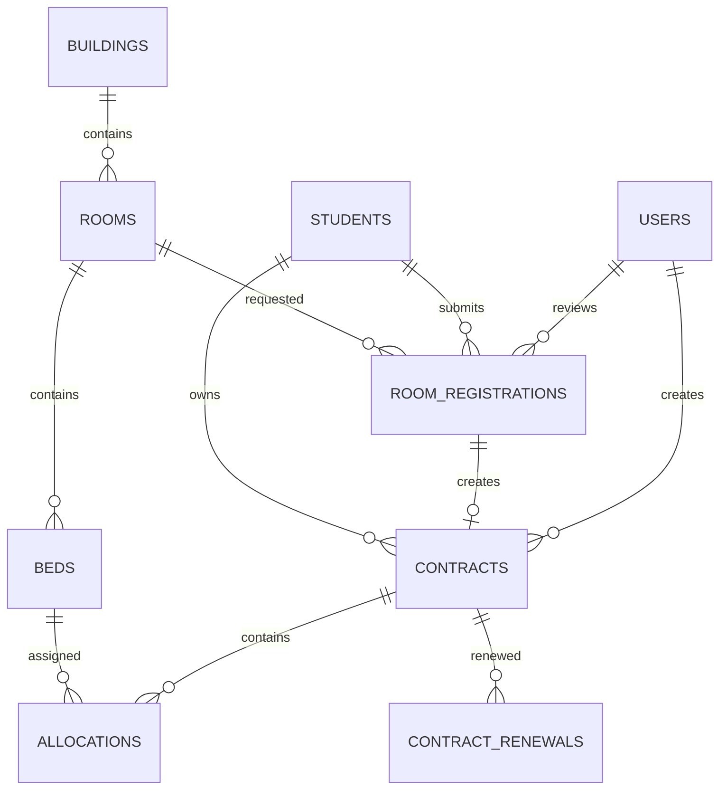

# Sơ đồ quan hệ thực thể (ERD)

Sơ đồ dưới đây phản ánh schema vật lý hiện tại của Module 1–3. Các bảng dịch vụ, hóa đơn và vi phạm được lược bớt để tập trung vào luồng đăng ký, phân giường và hợp đồng.

## Giải thích

1. **BUILDINGS / ROOMS / BEDS**: Cấu trúc cơ sở vật chất thực tế.
2. **STUDENTS**: Hồ sơ sinh viên dùng chung cho đăng ký và hợp đồng.
3. **ROOM_REGISTRATIONS**: Phòng nguyện vọng; đơn `approved` là đầu vào Module 3.
4. **CONTRACTS**: Hợp đồng lưu trú; một đơn chỉ tạo tối đa một hợp đồng.
5. **ALLOCATIONS**: Lịch sử phân giường. Allocation có `released_at = null` là vị trí hiện tại.
6. **CONTRACT_RENEWALS**: Lưu lịch sử thay đổi ngày hết hạn, không ghi đè mất dữ liệu cũ.

`contracts` không lưu `room_id`. Phòng hiện tại được xác định qua `contracts -> allocations -> beds -> rooms`, vì một hợp đồng có thể chuyển phòng nhiều lần.
