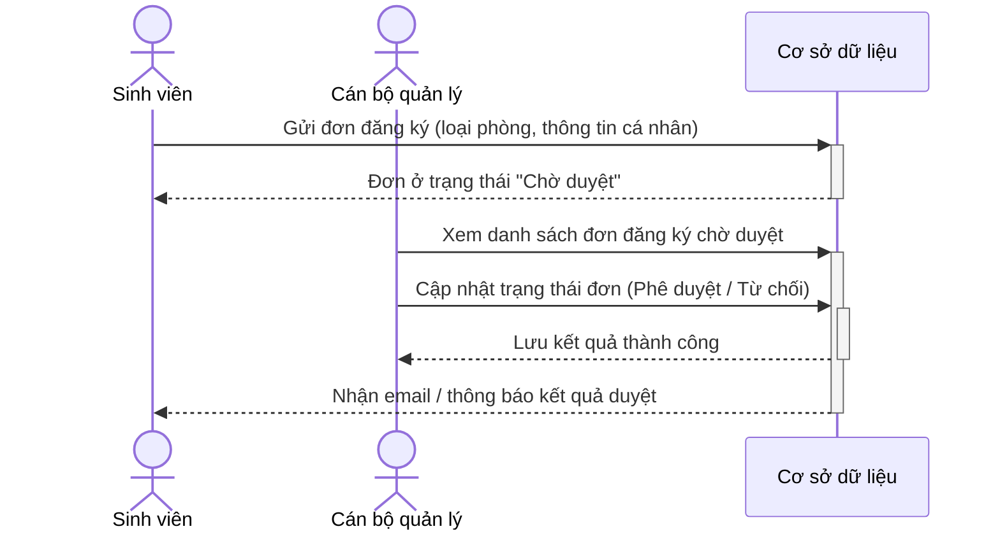

# Module Đăng ký chỗ ở

## 1. Mô tả tính năng
Cho phép sinh viên nộp đơn đăng ký nguyện vọng ở ký túc xá trực tuyến. Ban quản lý có công cụ để duyệt/từ chối đơn.

## 2. Quy trình đăng ký

## 3. Các quy định kiểm tra dữ liệu (Validation)
- Sinh viên phải điền đầy đủ các thông tin cá nhân bắt buộc.
- Điểm ưu tiên hoặc đối tượng ưu tiên phải tải lên minh chứng kèm theo (ảnh/tài liệu đính kèm - tùy chọn).
- Nếu đợt đăng ký đã khóa, nút đăng ký của sinh viên sẽ bị vô hiệu hóa.
