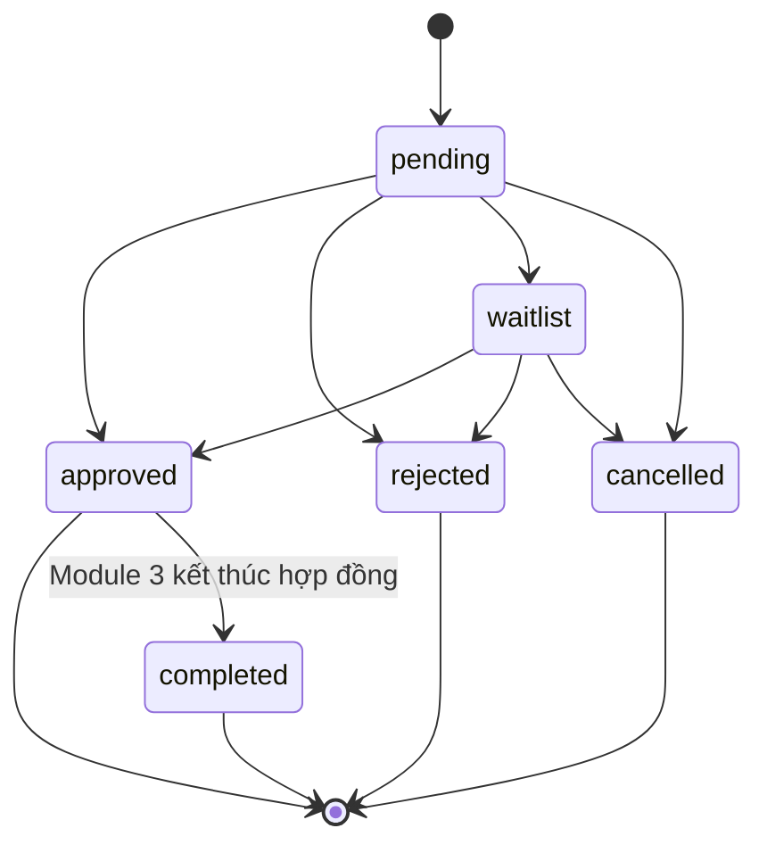

# Module Đăng ký chỗ ở

## 1. Mô tả tính năng

Module cho phép sinh viên gửi và theo dõi nguyện vọng phòng ở ký túc xá. Cán bộ có thể duyệt, từ chối hoặc chuyển đơn sang danh sách chờ. Dữ liệu đơn được giữ lại để phục vụ kiểm tra lịch sử và làm đầu vào cho Module 3 - Phân phòng & Hợp đồng.

`room_id` là phòng sinh viên đăng ký/nguyện vọng, chưa phải kết quả phân giường. Trong phạm vi hiện tại không có `RoomType`. Module 3 chỉ được phân một `Bed` thuộc đúng `Room` trên đơn đã được duyệt, trừ khi quy tắc nghiệp vụ được thay đổi chính thức.

## 2. Trạng thái và vòng đời đơn

Các trạng thái:

- `pending`: đang chờ cán bộ xử lý.
- `waitlist`: chưa được duyệt, đang trong danh sách chờ.
- `approved`: đã duyệt và đủ điều kiện chuyển sang Module 3.
- `rejected`: đã từ chối; bắt buộc lưu lý do.
- `cancelled`: sinh viên đã hủy; bản ghi vẫn được giữ lại.
- `completed`: Module 3 đã kết thúc hợp đồng lưu trú gắn với đơn; sinh viên có thể tạo đơn mới.

Các chuyển trạng thái hợp lệ:

`approved`, `rejected` và `cancelled` là trạng thái kết thúc trong phạm vi Module 2. Module 3 có thể chuyển `approved` sang `completed` khi hợp đồng hết hạn hoặc bị thanh lý. Khi duyệt hoặc từ chối, hệ thống ghi `reviewed_at` và `reviewed_by` nếu có người dùng đăng nhập. Khi hủy, hệ thống ghi `cancelled_at` và `cancellation_reason` tùy chọn; không xóa đơn khỏi cơ sở dữ liệu.

## 3. Quy tắc kiểm tra dữ liệu

- `student_code`, họ tên, email, giới tính, ngày sinh và `room_id` là bắt buộc.
- Email phải hợp lệ và không được thuộc về sinh viên khác.
- Ngày sinh không được nằm trong tương lai.
- Phòng nguyện vọng phải tồn tại và không ở trạng thái `maintenance`.
- Một sinh viên chỉ được có tối đa một đơn đang hoạt động (`pending`, `waitlist` hoặc `approved`). Quy tắc được kiểm tra ở application layer và bằng partial unique index trên cơ sở dữ liệu.
- Hồ sơ sinh viên đã tồn tại được nhận diện bằng `student_code` và cập nhật cùng transaction tạo đơn.
- Từ chối đơn bắt buộc có `rejected_reason`.

## 4. API chính

| Method | Endpoint | Mục đích |
| --- | --- | --- |
| `POST` | `/registration/store` | Tạo đơn ở trạng thái `pending` |
| `GET` | `/registration/status/{student}` | Xem lịch sử đơn của sinh viên |
| `DELETE` | `/registration/cancel/{roomRegistration}` | Hủy mềm đơn `pending` hoặc `waitlist` |
| `PUT` | `/registration/update/{roomRegistration}` | Duyệt, từ chối hoặc chuyển sang danh sách chờ |
| `GET` | `/registration/pending` | Lấy các đơn đang chờ duyệt |
| `GET` | `/registration/waitlist` | Chỉ lấy các đơn ở trạng thái danh sách chờ |

Response JSON dùng hai khóa nhất quán: `message` và `data` đối với thao tác thành công. Lỗi validation trả HTTP `422` cùng `message` và `errors` theo chuẩn Laravel.

## 5. Điều kiện bàn giao cho Module 3

Module 3 có thể sử dụng một đơn khi:

- Đơn vẫn tồn tại và có trạng thái `approved`.
- Sinh viên, phòng nguyện vọng và quan hệ foreign key đều hợp lệ.
- Giường được phân thuộc đúng phòng nguyện vọng trên đơn.
- Module 3 vẫn phải tự kiểm tra sức chứa, trạng thái giường, giới tính và hợp đồng đang hiệu lực; Module 2 không đảm nhiệm các ràng buộc này.
- Khi hợp đồng kết thúc, Module 3 chuyển đơn sang `completed`, ghi `completed_at` và `completed_by` để sinh viên có thể đăng ký đợt lưu trú tiếp theo.

## 6. Giới hạn bảo mật hiện tại

Dự án chưa có authentication/authorization hoàn chỉnh cho các endpoint cán bộ. Các route cập nhật trạng thái vì vậy chưa được bảo vệ theo vai trò. Ba giao diện hiện là HTML tĩnh và chưa gửi CSRF token, nên CSRF exclusion vẫn tồn tại nhưng đã được thu hẹp còn đúng ba endpoint thay đổi dữ liệu. Đây là security blocker cần xử lý trước khi triển khai production.
